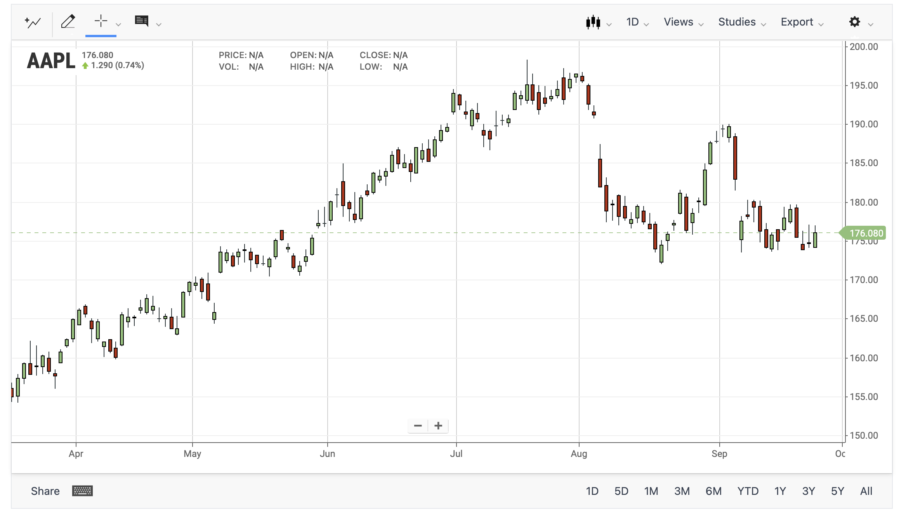
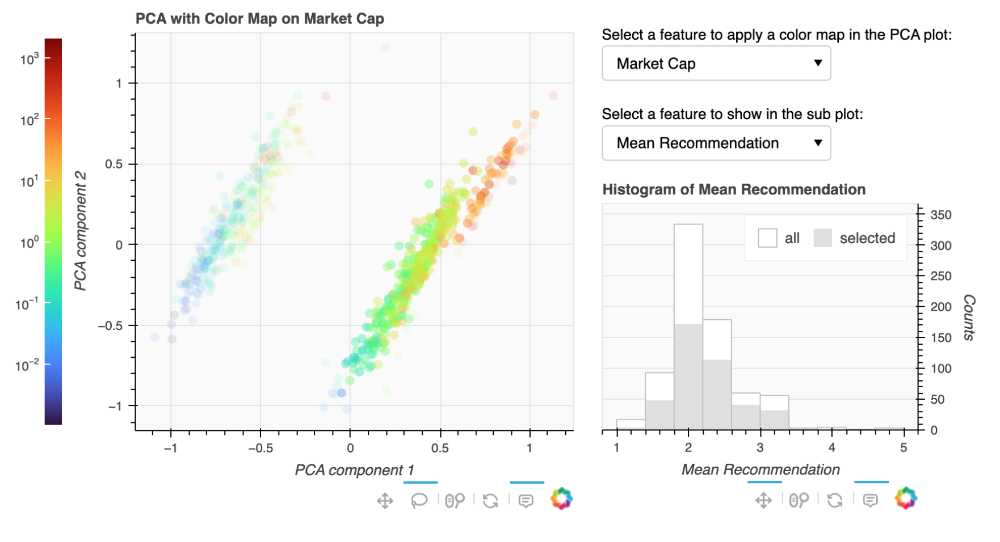

# Interactive Data Visualization — Visual Analytics Systems

This repository contains a collection of interactive data visualization systems designed to support exploratory analysis of complex and high-dimensional datasets. The projects focus on transforming raw data into interpretable visual analytics
through principled visual encodings and user-driven interaction. The emphasis is on clarity, analytical insight, and interactive exploration, rather than static presentation or decorative graphics.

---

## Scope & Technical Coverage

The repository covers multiple core aspects of modern data visualization and visual analytics:

### 1. Temporal and Financial Data Visualization
- Grouped bar charts for multi-level categorical time series
- Candlestick charts for stock price visualization
- Overlay of financial indicators with multiple y-axes
- Interactive legends, hover tools, panning, and zooming
- Export of interactive visualizations to standalone HTML


### 2. High-Dimensional Data Exploration
- Dimensionality reduction using Principal Component Analysis (PCA)
- Clustering in reduced feature spaces
- Scatter plots with dynamic color mappings
- Linked views combining global and selection-based statistics
- Lasso-based selection and coordinated updates across plots
`plot.html` contains a standalone interactive plot to be opened locally on a browser.



### 3. Interactive Visualization Applications
- Bokeh server–based visualization apps
- Widget-driven interaction (Select widgets, sliders, buttons)
- Event-driven callbacks for user interaction
- Coordinated multi-view layouts



### 4. Geospatial and Animated Visual Analytics
- Interactive geographic visualizations of aggregated company data
- Visual encoding of multiple variables using color and size
- Tap-based selection with linked subplots
- Slider-based filtering of data
- Time-based animation using periodic callbacks


---

## Implementation Details

All visualizations are implemented in **Python**, primarily using **Bokeh** for interactive plotting and application development. The repository emphasizes:

- Explicit data preprocessing and transformation pipelines  
- Careful choice of visual encodings for comparison and exploration  
- Modular visualization and callback functions  
- Reproducible, self-contained visualization outputs  

Interactive applications are executed using the **Bokeh server**, while standalone visualizations are exported as HTML files.

---

## Repository Structure

```text
.
├── grouped_bar_charts/
│   └── financial_indicators_over_time.py
│
├── candlestick_charts/
│   └── stock_price_with_metrics.py
│   └── plot.html
│
├── high_dimensional_analysis/
│   └── pca_clustering_visual_analytics.py
│
├── geospatial_visualization/
│   └── interactive_company_map.py
│
├── README.md
└── requirements.txt
```

## Technologies

- Bokeh
- Python
- Pandas, NumPy
- scikit-learn
- SciPy